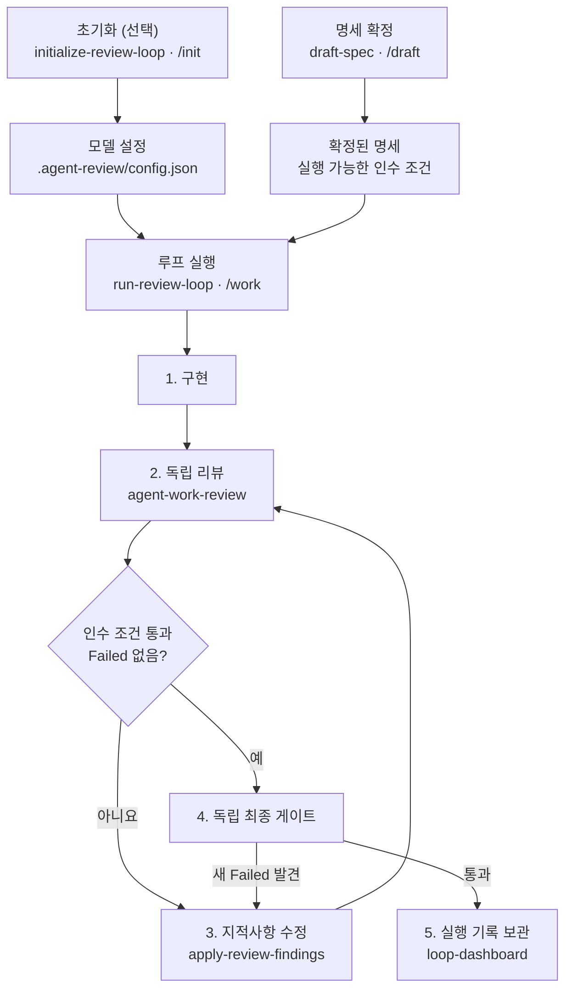

# Veriloop

[English README](./README.md)

Codex와 Claude Code에서 함께 사용하는 **명세 기반 코드 리뷰·수정 루프**입니다.

에이전트가 작성한 변경을 다섯 관점으로 검증하고, 실패 항목이 사라지고 목표의 인수 조건이 실제 명령으로 확인될 때까지 최대 3회 반복합니다.

## 스킬 아키텍처



`agent-work-review`는 단독으로도 사용할 수 있습니다. 확인된 명세가 없으면 먼저 `draft-spec`으로 연결되며, 명세 없는 변경을 추측으로 승인하지 않습니다.

## 권장 워크플로

| 단계 | Codex | Claude Code | 결과 |
|---|---|---|---|
| 0. 역할별 모델 설정 *(선택)* | `$initialize-review-loop` | `/init` | `.agent-review/config.json`과 findings ledger |
| 1. 작업 명세 확정 | `$draft-spec` | `/draft` | 저장소 규칙과 실행 가능한 인수 조건이 포함된 명세 |
| 2. 구현·리뷰·수정 실행 | `$run-review-loop <목표>` | `/work <목표>` | 검증된 변경과 최종 판정 |
| 3. 실행 결과 확인 | `$loop-dashboard` 또는 자연어 요청 | 자연어 요청 | 오프라인 HTML 대시보드 |

### 0. 루프 초기화 *(선택)*

개발자·수정자·리뷰어·최종 게이트에 사용할 모델을 저장소별로 선택합니다.

```text
# Codex
$initialize-review-loop

# Claude Code
/init
```

설정은 `.agent-review/config.json`에 저장됩니다. 지정한 모델을 사용할 수 없으면 다른 모델로 몰래 대체하지 않고 루프를 중단합니다.

### 1. 명세 작성과 확인

`draft-spec`은 저장소의 `AGENTS.md` / `CLAUDE.md`, 관련 코드, 테스트, 기존 패턴을 먼저 조사한 뒤 작업 명세를 만듭니다. 각 인수 조건에는 테스트 명령이나 검색 assertion처럼 **그대로 실행할 수 있는 확인 방법**이 연결됩니다.

```text
# Codex
$draft-spec 차량별 연료 합계 API를 추가해줘

# Claude Code
/draft 차량별 연료 합계 API를 추가해줘
```

초안은 독립적인 guess-hunt 검토를 거쳐, 근거 없이 가정한 결정을 찾아냅니다. 사용자가 명세를 확인하기 전에는 구현 루프가 시작되지 않습니다.

### 2. 목표와 함께 루프 실행

목표에는 확정된 명세와 검증 가능한 완료 조건을 적습니다.

```text
# Codex
$run-review-loop docs/fleet-fuel-spec.md 기준으로 연료 합계 API를 구현하고 기존 호출자와 데이터 호환성을 유지해줘

# Claude Code
/work docs/fleet-fuel-spec.md 기준으로 연료 합계 API를 구현하고 기존 호출자와 데이터 호환성을 유지해줘
```

루프 내부에서는 다음 순서가 반복됩니다.

1. 기존 diff가 없다면 명세에 맞게 구현합니다.
2. 새 컨텍스트의 리뷰어가 다섯 관점으로 변경을 검토합니다.
3. 인수 조건을 실제 명령으로 실행하고 `Failed` 여부를 확인합니다.
4. 실패 항목을 수정한 뒤 다시 리뷰합니다.
5. 완료 조건을 만족하면 별도의 최종 게이트가 독립적으로 재검증합니다.

### 3. 종료와 결과 확인

루프는 아래 조건을 모두 만족해야 성공으로 끝납니다.

- 명세의 실행 가능한 인수 조건이 모두 통과
- 리뷰 판정이 `Pass` 또는 `Pass with warnings`
- 독립 최종 게이트에서 새로운 `Failed`가 발견되지 않음

안전장치로 최대 3회까지만 반복하며, 실패 항목이 줄지 않거나 되살아나는 경우 사용자에게 판단을 요청합니다. `Warning`만 남은 경우에는 루프를 계속 돌리지 않고 각각 수용·이슈 등록·즉시 정리 중 하나로 처리합니다.

완료된 실행은 `.agent-review/runs/`에 보관됩니다. `loop-dashboard`는 반복별 실패 원인, Failed/Warning 추이, 해결된 항목, 목표 검증 결과를 외부 CDN 없는 단일 HTML로 보여줍니다.

## 필요한 기능만 사용하기

### 현재 변경만 리뷰

다음처럼 자연어로 요청하거나 `$agent-work-review`를 직접 호출합니다.

- “에이전트가 방금 만든 변경을 리뷰해줘”
- “커밋 전에 현재 diff를 확인해줘”
- “이 브랜치를 병합해도 안전한지 검토해줘”

리뷰 범위는 **사용자가 지정한 PR·커밋·경로 → 커밋하지 않은 변경 → 기본 브랜치와 현재 브랜치의 차이** 순으로 결정됩니다. 리뷰는 코드를 수정하지 않습니다.

### 기존 리뷰 지적사항만 반영

```text
$apply-review-findings
```

`Failed` 항목을 실제 코드에서 다시 확인한 뒤 수정하고, 해결된 항목은 `Pass`로 보고합니다.

### 이전 실행을 대시보드로 보기

```text
$loop-dashboard
```

## 리뷰가 확인하는 다섯 관점

| 관점 | 확인 내용 |
|---|---|
| **Regression** | 이름이 바뀐 심볼의 미수정 호출자, 직렬화 계약 파손, 몰래 완화된 테스트 |
| **Performance** | N+1 쿼리, 반복문 안 I/O, sync-over-async, 무제한 조회, 누락된 페이지네이션 |
| **Cost** | 요청량·데이터량에 따라 증가하는 API·LLM·SMS·지도·egress·로그 비용과 Cosmos DB RU |
| **Readability** | 설명만 반복하는 주석, 과도한 방어 래핑, 추측성 일반화, 죽은 코드 |
| **Conventions** | 일반론이 아니라 현재 저장소의 규칙, 린터 설정, 인접 코드 패턴과의 차이 |

모든 finding은 실제 코드에서 재검증되며 `Confirmed` 또는 `Needs verification`으로 표시됩니다. 결과는 `Failed`와 `Warning`으로 분류하고 최종 판정은 `Pass`, `Pass with warnings`, `Fail` 중 하나입니다. 문제가 발견되지 않은 검사와 수정 완료된 finding도 명시적으로 `Pass`로 남깁니다.

## 설치

### Codex

```bash
codex plugin marketplace add bgun42/veriloop
codex plugin add veriloop@veriloop
```

설치 후 새 Codex 작업을 시작하면 번들 스킬이 검색됩니다.

### Claude Code

```text
/plugin marketplace add bgun42/veriloop
/plugin install veriloop@veriloop
```

별도 설정 없이 사용할 수 있으며, 리뷰할 때마다 현재 저장소의 규칙을 읽습니다.

## 실행 기록과 CI

| 경로 | 용도 |
|---|---|
| `.agent-review/config.json` | 루프 역할별 모델 설정 |
| `.agent-review/ledger.json` | 반복을 가로지르는 finding 상태: open, Pass, recurred, accepted |
| `.agent-review/runs/` | 완료된 실행 기록과 대시보드 입력 |

모든 리뷰 보고서 끝에는 `verdict`와 `findings[]`를 포함한 기계 판독용 JSON 블록이 붙습니다. GitHub Actions 게이트와 Claude Code Stop hook 연결 방법은 [docs/ci.md](docs/ci.md)를 참고하세요.

> **Claude Code 전용:** 루프를 직접 실행하지 않은 세션까지 매번 강제로 리뷰하려면 사용자 설정에 Stop hook을 연결해야 합니다. 이는 사용자별 실행 환경 설정이므로 플러그인이 자동 설치하지 않습니다.

## 저장소 구조

<details>
<summary>플러그인 파일 구성 보기</summary>

```text
.agents/plugins/marketplace.json  # Codex Git marketplace entry
.codex-plugin/plugin.json         # Codex plugin manifest
.claude-plugin/plugin.json        # Claude Code plugin manifest
commands/
├── init.md                       # Claude Code 초기화 명령
├── draft.md                      # Claude Code 명세 작성 명령
└── work.md                       # Claude Code 루프 실행 명령
skills/
├── initialize-review-loop/       # 역할별 모델과 ledger 초기화
├── draft-spec/                   # 저장소 분석 → 명세 초안 → 사용자 확인
├── run-review-loop/              # 구현 → 리뷰 → 수정 → 최종 게이트
├── agent-work-review/            # 다섯 관점의 독립 리뷰
├── apply-review-findings/        # 검증된 지적사항 수정
└── loop-dashboard/               # 실행 기록 HTML 시각화
```

</details>

## 라이선스

MIT
